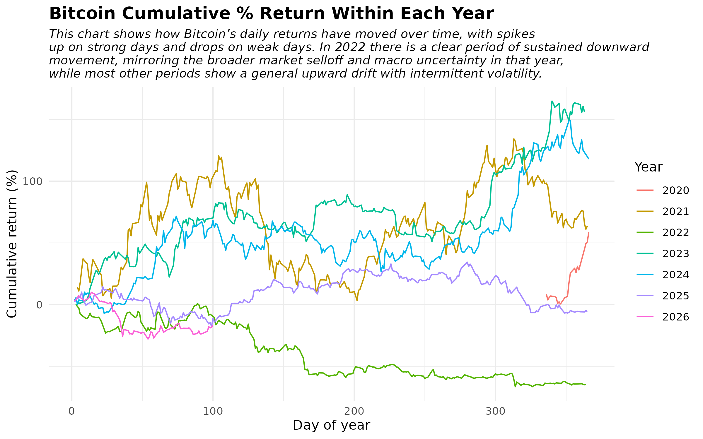
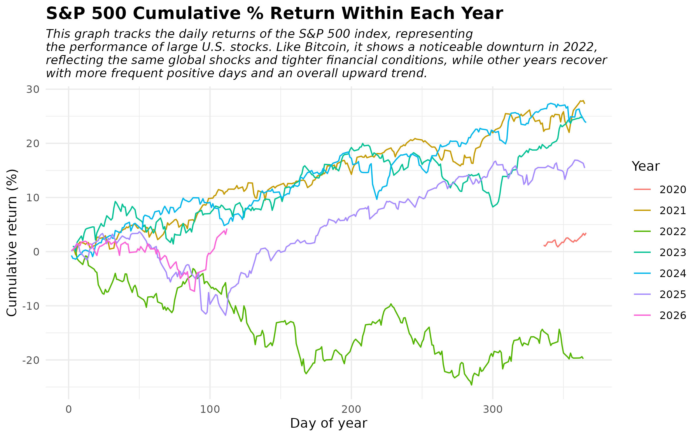
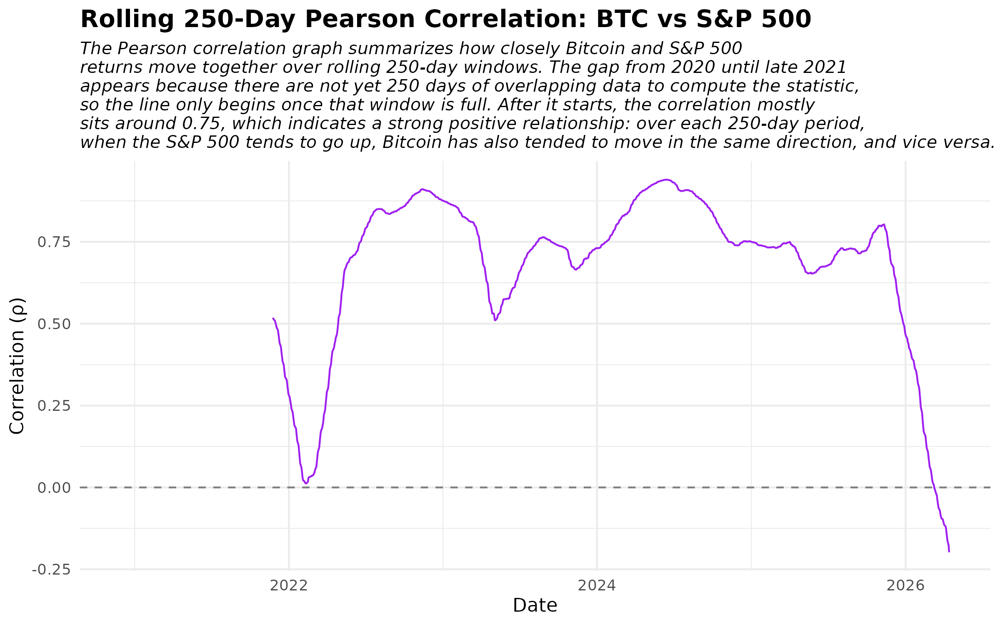

# Daily BTC/SP500 Analysis

Latest update: Mon Dec 29 06:40:11 UTC 2025

Hello my name is Akarsh, and this is my project. 
This project tracks the relationship between Bitcoin and the S&P 500 using two live, web-based data sources that update every trading day.
Bitcoin prices are pulled from a public cryptocurrency data API that provides daily open, high, low, close, and volume in U.S. dollars,
while S&P 500 index levels are downloaded in CSV format from a free market-data site that maintains historical daily prices for major 
equity indices.  A GitHub Actions workflow runs once per day in the cloud, automatically executing R scripts that download the latest
data from both sources, clean and align the time series by date, and append the new observations to a growing CSV inside the repository.
This automated data pipeline means the dataset and plots update themselves without manual intervention, demonstrating how reproducible
workflows and scheduled jobs can maintain an always-current view of a financial relationship.
  The data is wrangled in R using tidyverse and other data handling tools to filter out missing values, convert raw prices into daily returns,
and compute rolling six-month Pearson correlations between Bitcoin and S&P 500 returns so that short-term co-movements become visible.
The resulting visualizations are simple time-series line charts: one chart shows Bitcoin returns, one shows S&P 500 returns, and a
combined chart overlays both so a viewer with no finance background can see when the two markets move together or diverge—for example,
periods when both spike or crash at the same time versus periods when Bitcoin behaves differently from stocks. 
## Visualizations

### BTC RETURN

### SP500 RETURNS

### BTC SP500 OVERLAY

## Final Report and Overview

  This project analyzes how Bitcoin and the S&P 500 move together over time using two web-based data sources that update daily. Bitcoin
prices come from a public cryptocurrency API that provides daily open, high, low, close and volume in U.S. dollars. S&P 500 index 
levels are downloaded as CSV files from a free market data provider that publishes historical daily prices for major equity indices.
These two series matter because the co-movement between Bitcoin and U.S. equities has changed over the last decade. Researchers have
found that crypto now moves more in sync with stock markets rather than acting as a separate safe haven asset. By tracking both side
by side, the project shows how tightly Bitcoin is currently linked to the broad U.S. equity market.

The core of the project is an automated data pipeline built with GitHub Actions and R. A scheduled workflow runs once per day in
the cloud at a fixed time. It executes two R scripts. One script pulls the latest Bitcoin and S&P 500 data from their online sources.
The other script performs the analysis and refreshes the visualizations. The first script reads the existing CSV of historical prices,
requests any new daily observations that have appeared since the last run and appends them so the dataset grows over time instead of
being re-downloaded. The second script cleans and organizes the updated data. It converts dates into a consistent format, orders the
series by time, computes daily returns from closing prices and then calculates a rolling 250-day Pearson correlation between Bitcoin
and S&P 500 returns. The rolling window shows how the strength of the relationship changes over time instead of assuming it is constant.

The cleaned data feed into time series visualizations designed for readers who may have no experience with finance or statistical modeling.
One chart shows Bitcoin’s cumulative percentage return within each calendar year. Another shows the same for the S&P 500. A third chart
plots the rolling 250-day correlation between the two series. Line charts are used throughout because they clearly display how quantities
change over time. The horizontal axis shows calendar date or day of year, and the vertical axis shows cumulative return in percent or
the correlation value between −1 and 1. The visualizations explain that rising lines mean positive returns, falling lines
mean losses and correlation values near +1 show the two markets move together. Values near 0 indicate weak co-movement and negative
index values mean opposite movement. This allows a non-expert to scan the plots and see shared downturns around major events and generally
high positive correlation in recent years. Bitcoin has behaved more like a risk asset than an independent diversifier, but in the recent past,
from oveserving the pearson plot, we can say that bitcoin has been acting as a diversifier, but with high volatility.

The most challenging part of the project was making the process robust and fully automated. Setting up GitHub Actions to run R scripts
on a schedule required attention to package installation, file paths and permissions. The workflow needed to pull new data, update the
CSV, regenerate plots and commit changes to the repository without manual intervention. Real-world financial data also introduced issues
such as missing dates, non-trading days and periods with incomplete Bitcoin history. These needed to be aligned before computing
correlations. Working through these challenges showed how much effort goes into a reliable data pipeline compared to a one-time analysis.
Beyond statistical ideas, details like date handling, incremental updates and clear visual design were critical, alongside matching data types
that were being retrieved from different sources. The project demonstrated the value of reproducible workflows and automated scheduling 
for time series analysis that needs to stay current. It also provided experience in turning messy web data into visual summaries that others 
can interpret at a glance.

